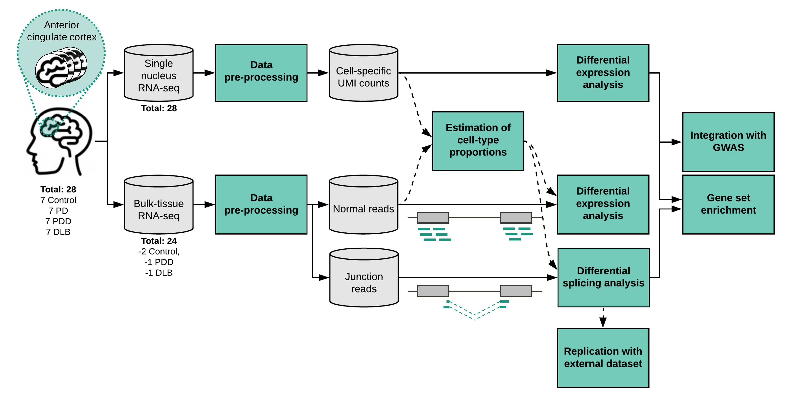

```{r setup, include=FALSE}

library(DESeq2)
library(DEGreport)
library(devtools)
library(DT)
library(ggsci)
library(tidyverse)
library(stringr)
library(readxl)
library(rjson)
devtools::load_all(path = "/home/rreynolds/packages/EWCE/")
devtools::load_all(path = "/home/rreynolds/projects/MarkerGenes/")

theme_rhr <-  theme_bw(base_family = "Helvetica") + 
  theme(panel.grid.major.x = element_blank(),
        legend.position = "top",
        strip.text = element_text(size = 8),
        axis.text.x = element_text(size = 8, angle = 90, hjust = 1, vjust = 0.5),
        axis.text.y = element_text(size = 8),
        axis.title.y = element_text(vjust = 0.6),
        axis.title = element_text(size = 10),
        panel.spacing = unit(0.1, "lines"))

knitr::opts_chunk$set(echo = F, warning = F, message= F)
```

> Aim: identification of (i) differentially expressed genes and (ii) differentially spliced genes, and their associated molecular pathways, that distinguish between control, PD, PDD and DLB.

# File paths for workflow

```{r file-paths, echo = T}

source(here::here("R", "file_paths.R"))

```

# Background

## Sample details and demographics {.tabset}

### Column descriptions
```{r sample-info-col-descriptions}
read_excel(path = file.path(
  path_to_raw_data,
  "sample_details/20201229_MasterFile_SampleInfo.xlsx"
), 
sheet = "ColumnDescriptions") %>%
  dplyr::filter(`Column Name` %in% c("CaseNo", "Disease_Group", "Sex", "AoO", "AoD", "DD", "PMI", "aSN", "TAU", "thal AB", "aCG aSN score", "RINe_bulkRNA_Tapestation")) %>% 
  DT::datatable(rownames = FALSE,
                options = list(scrollX = TRUE),
                class = 'white-space: nowrap')
```

### Table of samples
```{r sample-info}

sample_info <- 
  read_excel(path = 
               file.path(
                 path_to_raw_data,
                 "sample_details/20201229_MasterFile_SampleInfo.xlsx"
               ), 
             sheet = "SampleInfo", 
             skip = 1)  %>% 
  dplyr::filter(Sample_Type == "Tissue section" & sent_to_bulk_seq == "yes") %>% 
  dplyr::select(CaseNo, Disease_Group, Sex, AoO, AoD, DD, PMI, aSN, TAU, 'thal AB', 'aCG aSN score', RINe_bulkRNA_Tapestation) %>% 
  dplyr::mutate(Disease_Group = Disease_Group %>% 
                  ordered(levels = c("Control", "PD", "PDD", "DLB")))

sample_info %>% 
  DT::datatable(rownames = FALSE,
                options = list(scrollX = TRUE),
                class = 'white-space: nowrap')
```

### Correlations between covariates
- Using the package ```DEGreport``` can easily plot the correlation amongst covariates. 
```{r sample-covar-cor, eval = T, echo = T, fig.cap="Plot of correlations between sample covariates."}

dds <- 
  readRDS(
    file.path(
      path_to_results,
      "Salmon_quant/bulk_tissue/PD_tissue_polyA_DESeqDataSet_design_SexRINAoD.Rds"
    )
  )

DEGreport::degCorCov(colData(dds))

```

- As might be expected, alpha-synuclein staging was correlated with disease group. Interestingly, OPC proportions were also correlated with disease group. In addition, proportions of excitatory and inhibitory neurons were correlated.

## Methodological workflow



All steps below, describe the workflow for bulk-tissue RNA-sequencing:

1. **Data pre-processing**
    - Pre-alignment QC using `fastp` combined with `fastQC`.
    - Alignment using `STAR`.
    - Post-alignment QC using `RNASeqQC`. 
2. **Gene-level quantification**
    - [`Salmon`](https://www.nature.com/articles/nmeth.4197) used to quantify gene-level reads. 
3. **Estimation of cell-type proportions (deconvolution)**
    - Estimate cell-type proportions for use in differential expression/splicing models. 
    - Used [`Scaden`](https://advances.sciencemag.org/content/6/30/eaba2619).
3. **Differential gene-level expression**
    - `DESeq2` used for differential expression analyses.
4. **Differential splicing**
    - [`Leafcutter`](https://www.nature.com/articles/s41588-017-0004-9) used. Defines intron clusters by shared junctions and calculates differential usage of introns within a cluster across case/controls.
5. **Replication with external dataset**
    - Used PD case/control study available on `recount2` (ctrl = 44, case = 29). Study SRP058181 on https://jhubiostatistics.shinyapps.io/recount/.
    - Used this dataset for validation of Scaden-predicted cell-type proportions & differential splicing.
6. **Integration with GWAS**
    - Heritability enrichment analyses using [stratified LD score regression](https://pubmed.ncbi.nlm.nih.gov/26414678/).
    - Genetic association analyses using [H-MAGMA](https://pubmed.ncbi.nlm.nih.gov/32152537/). H-MAGMA advances MAGMA by incorporating chromatin interaction profiles from human brain tissue.
7. **Gene set enrichment**
    - Used [`clusterProfiler`](https://bioconductor.org/packages/release/bioc/html/clusterProfiler.html).
    
# Data pre-processing {.tabset}

## File transfer
- For details of transfer and appropriate checks refer to: [RNAseq_data_transfer.html](../QC/RNAseq_data_transfer.html)

## Pre-alignment QC
- Fastq files were de-multiplexed by ICR sequencing centre, using `bcl2fastq` and the following flags.
    - `--mask-short-adapter-reads 0` 
    - `--use-bases-mask Y*,I8Y7,I8,Y*` 
    - `--no-lane-splitting` 
    - `--output-dir`
    - `--runfolder-dir`
    - `--sample-sheet`
- See the following files for a nohup log of this provided by the ICR: `/data/RNAseq_PD/tissue_polyA_samples/raw_data/bcl2fastq_demultiplex_nohup_1091.e`.
- Samples were trimmed using fastp (v 0.20.0).

```{bash, echo = T, eval = F}
# prefix to file names always NM followed by 4 digits, therefore "NM...._", will remove anything between 'NM' and '_' 
nohup Rscript \
/home/rreynolds/packages/RNAseqProcessing/QC/prealignmentQC_fastp_PEadapters.R \
/data/RNAseq_PD/tissue_polyA_samples/raw_data \
/data/RNAseq_PD/tissue_polyA_samples/QC \
PD_tissue_polyA \
NM...._ \
_.* \
&>/home/rreynolds/projects/Aim2_PDsequencing_wd/LBD-seq-bulk-analyses/nohup_logs/PD_tissue_polyA_fastp.log&

```

### Results
- QC report: `r  xfun::embed_file(path = file.path(path_to_bulk_seq_data, "QC/multiqc/PD_tissue_polyA.html"), name = "PD_tissue_polyA.html", text = "download multiqc report")`
- Per base sequence content: 24 samples failed and 26 samples with a warning. 
    - This warning is often triggered due to the biases of random hexamer priming (https://sequencing.qcfail.com/articles/positional-sequence-bias-in-random-primed-libraries/). 
    - What is more concerning is that ACGT are not evenly called across read pairs. Instead, G/C appear to be underrepresented/overrepresented depending on which of the two reads in a read pair is being analysed. The NovaSeq is a two-channel system, which is known to overcall Gs (https://sequencing.qcfail.com/articles/illumina-2-colour-chemistry-can-overcall-high-confidence-g-bases/). Speaking to Sabri at the UCL Institute for Cancer Research, the per base sequencing content can have quite varied distribution of nucleotide content in NovaSeq runs and if GC content is normal then there is no cause for concern.

```{r fastp QC, echo = F}

source(here::here("R", "get_fastp_QC_df.R"))

QC <- 
  get_fastp_QC_df(
    fastp_json_dir_paths = file.path(
      path_to_bulk_seq_data,
      "QC/fastp/"
    )
  ) %>% 
  dplyr::select(SampleID, reads_unknown_insert_size_percent, everything())

ggplot(data = QC %>% 
         dplyr::filter(!SampleID == "Undetermined"), 
       aes(x = MarkerGenes::reorder_within(x = SampleID,
                                           by = reads_unknown_insert_size_percent,
                                           within = SampleID,
                                           fun = max,
                                           desc = TRUE),
                      y = reads_unknown_insert_size_percent)) +
  geom_bar(position = position_dodge(width = 0.9), stat="identity") +
  MarkerGenes::scale_x_reordered() +
  ylim(c(0,100)) +
  labs(x = "", y = "% reads with unknown insert size") +
  theme_rhr
  
  
```


## Alignment
- Using STAR (v2.7.0a)
- Read groups generated and added to BAMs during STAR alignment to allow for future de-duplication, if necessary. Generation of read group headings requires information regarding flow cell, lane and adaptors for each sample, which can be found within the raw files from the sequencing provider. For this project this is summarised here: `r  xfun::embed_file(path = file.path(path_to_raw_data, "sample_details/Flowcell_info.txt"), name = "Flowcell_info.txt", text = "download flowcell information")`
- Aligned to genome build GRCh38, and ensembl v97 .gtf file used for annotation.
- Multi-sample 2-pass star was run. This is performed in three steps:
    1. Run 1st mapping pass for all samples with "usual" parameters.
    2. Merge all SJ.out.tab files from all samples and remove duplicated junctions.
    3. Run 2nd mapping pass for all samples with "usual" parameters, and the addition of the merged SJ.out.tab file in the `--sjdbFileChrStartEnd` flag.
- Undetermined fastq (i.e. reads that weren't assigned to a sample) not aligned.

### STAR 1st pass
```{bash, echo = T, eval = F}
# STAR 1st pass
nohup Rscript \
/home/rreynolds/packages/RNAseqProcessing/alignment/STAR_alignment_withReadGroups_multi2pass.R \
/data/RNAseq_PD/tissue_polyA_samples/QC/fastp \
/data/STAR_data/genome_index_hg38_ens_v97/sjdbOverhang_99 \
/data/RNAseq_PD/tissue_polyA_samples/STAR \
--sample_prefix=NM...._ \
--sample_suffix=_S.* \
--read_groups=/home/rreynolds/projects/Aim2_PDsequencing_wd/raw_data/sample_details/Flowcell_info.txt \
&>/home/rreynolds/projects/Aim2_PDsequencing_wd/LBD-seq-bulk-analyses/nohup_logs/PD_tissue_polyA_STAR_1pass.log&

# SJ.out.tab files moved to SJ_out_1pass folder
mv /data/RNAseq_PD/tissue_polyA_samples/STAR/*.SJ.out.tab /data/RNAseq_PD/tissue_polyA_samples/STAR/SJ_out_1pass/
```

### Merging and filtering splice junctions
- For details, refer to html report:  [STAR_splice_junction_filtering.html](../QC/STAR_splice_junction_filtering.html)

```{bash, echo = T, eval = F}
nohup Rscript \
/home/rreynolds/packages/RNAseqProcessing/alignment/STAR_splice_junction_merge.R \
/data/RNAseq_PD/tissue_polyA_samples/STAR/SJ_out_1pass \
-o /data/RNAseq_PD/tissue_polyA_samples/STAR/ \
&>/home/rreynolds/projects/Aim2_PDsequencing_wd/LBD-seq-bulk-analyses/nohup_logs/PD_tissue_polyA_SJ_filtering.log&
```

### STAR 2nd pass
```{bash, echo = T, eval = F}
# STAR 2nd pass
nohup Rscript \
/home/rreynolds/packages/RNAseqProcessing/alignment/STAR_alignment_withReadGroups_multi2pass.R \
/data/RNAseq_PD/tissue_polyA_samples/QC/fastp \
/data/STAR_data/genome_index_hg38_ens_v97/sjdbOverhang_99 \
/data/RNAseq_PD/tissue_polyA_samples/STAR \
--sample_prefix=NM...._ \
--sample_suffix=_S.* \
--read_groups=/home/rreynolds/projects/Aim2_PDsequencing_wd/raw_data/sample_details/Flowcell_info.txt \
--sj_file=/data/RNAseq_PD/tissue_polyA_samples/STAR/merged_junctions.SJ.out.tab \
&>/home/rreynolds/projects/Aim2_PDsequencing_wd/LBD-seq-bulk-analyses/nohup_logs/PD_tissue_polyA_STAR_2pass.log&

```

## Post-alignment QC
- Script includes sorting and indexing of .bam files with samtools, as most downstream programs require sorted and indexed bam files.

```{bash, echo = T, eval = F}
# Post-alignment QC script
nohup Rscript \
/home/rreynolds/packages/RNAseqProcessing/QC/post_alignment_QC_RSeQC.R \
/data/RNAseq_PD/tissue_polyA_samples/STAR \
/data/RNAseq_PD/tissue_polyA_samples/QC/ \
/data/references/ensembl/bed/v97/ensembl_GRCh38_v97.bed \
100 \
--sample_suffix=_Aligned.sortedByCoord.out.bam \
&>/home/rreynolds/projects/Aim2_PDsequencing_wd/LBD-seq-bulk-analyses/nohup_logs/PD_tissue_polyA_postalignment_QC.log&

# MultiQC for full report
multiqc /data/RNAseq_PD/tissue_polyA_samples/ \
-o /data/RNAseq_PD/tissue_polyA_samples/QC/multiqc/ \
--ignore /data/RNAseq_PD/tissue_polyA_samples/raw_data/ \
-n PD_tissue_polyA_full_report
```

### Results
- QC report: `r  xfun::embed_file(path = file.path(path_to_bulk_seq_data, "QC/multiqc/PD_tissue_polyA_full_report.html"), name = "PD_tissue_polyA_full_report.html", text = "download multiqc report")`
- In general, QC looks fine. 
    - Observe a 3'-bias over gene body coverage, which is unsurprising given library construction protocol. Important to use count models that account for this (e.g. Salmon).
    - Interesting to note the junction saturation profile for most samples -- novel junctions do not appear to saturate at 100% of the reads. Also, increasing the number of reads disproportionately affects the number of observed novel junctions vs observed known junctions i.e. the rate of increase in the number observed is higher for novel junctions than known junctions.
    
# Gene-level quantification 
- `Salmon` used as:
    1. It is faster (due to quasi-mapping)
    2. It corrects for a lot of biases in data. 
    3. It's output can be combined with `DESeq2`.
- For details of workflow, see: [Salmon_quantification.html](../quantification_gene/Salmon_quantification.html)
- Note: For all downstream analyses (gene-level and splicing), ENCODE blacklist regions were removed from the analysis. It is worth noting that these blacklisted regions do overlap some known PD-associated genes. For details, see: [PD_overlap_with_blacklist.html](../misc/PD_overlap_with_blacklist.html) 

## Post-quantification QC
- As might be expected, distribution of counts (log2 counts per million, log2CPM) demonstrates that samples with a median log2CPM lower than the median across all samples typically also have a lower RIN. 
- All samples' gene expression of *XIST* and *DDX3Y* agree with sex assigned in sample information.
- Using uncorrected counts (i.e. not corrected by sex, RIN, etc.), samples appear to be clustering by RIN. RIN is also highly correlated to PC1, while PC2 is correlated with AoD. Based on these analyses, have decided to correct for RIN, sex and AoD in downstream analyses (in addition to cell proportions, once these are estimated).
- For details, see: [Post_quantification_QC.html](../quantification_gene/Post_quantification_QC.html)

# Deconvolution
- Used [Scaden](https://github.com/KevinMenden/scaden).
- Summary of workflows:
    - [deconvolution_scaden.html](../deconvolution/deconvolution_scaden.html)
    - [deconvolution_scaden_rerun.html](../deconvolution/deconvolution_scaden_rerun.html) - following decision to cluster endothelial cells and pericytes together into one vascular cell cluster, deconvolution was re-run.
- Worth noting that when we correct gene expression for cell-type, disease groups cluster separately on plot of PC1 and PC2 axes. For details, see: [Post_correction_PCA.html](../quantification_gene/Post_correction_PCA.html)

# Differential gene expression analyses with DESeq2
- `DESeq2` takes as input un-normalised counts from a variety of sources (e.g. `Salmon`, `HTSeq`)(see [here](http://master.bioconductor.org/packages/release/workflows/vignettes/rnaseqGene/inst/doc/rnaseqGene.html#preparing-count-matrices)) 
- For details of workflow, see: [DESeq2_DEGanalysis.html](../quantification_gene/DESeq2_DEGanalysis.html)

# Differential splicing with LeafCutter
- For details of leafcutter results and pathway analysis, see: [Leafcutter.html](../quantification_splicing/Leafcutter.html)
- For details of intron annotation of leafcutter results, see: [Leafcutter_intron_annotation.html](../quantification_splicing/Leafcutter_intron_annotation.html)
- Also used STAR junction output (i.e. SJ.out.tab files) to determine proportions of annotated/partially annotated/unannotated junctions across groups. This analysis used all junctions, regardless of whether they were found to be differentially spliced across groups. For details, see: [STAR_intron_annotation.html](../quantification_splicing/STAR_intron_annotation.html)

## Enrichment of U2/U12-type introns
- Used introns/clusters derived from Leafcutter to interrogate enrichment of U2/U12-type introns. For details, see: [Leafcutter_spliceosome.html](../quantification_splicing/Leafcutter_spliceosome.html)

## RNA-binding protein motif enrichment
- Used introns/clusters derived from Leafcutter to interrogate RNA-binding protein motif enrichment. For details, see: [rbp_differential_splicing.html](../rbp_analysis/rbp_differential_splicing.html)

# Replication with external dataset
- Replication with recount study, SRP058181. 
- For further details and overview, see: [SRP058181.html](../replication/SRP058181.html)
    
# Integration with GWAS
- sLDSC
    - GWAS formatted ready for sLDSC analyses. See: [FormattingGWASforLDSC.html](../sLDSC/FormattingGWASforLDSC.html)
    - sLDSC applied to cell-type specificity deciles: [LDSC_cell_type_specificity_deciles.html](../sLDSC/LDSC_cell_type_specificity_deciles.html)
    - sLDSC applied to cell-type differential expression: [LDSC_cell_type_DEG.html](../sLDSC/LDSC_cell_type_DEG.html)
    
# Scripts and logs
- Scripts used in the pre-processing of this data are available in [```RNASeqProcessing```](https://github.com/RHReynolds/RNAseqProcessing).
- Additional ad-hoc scripts used within the `.html` files linked above can be found in the [`misc_scripts`](https://github.com/RHReynolds/LBD-seq-bulk-analyses/blob/main/misc_scripts) directory of this project. Many processes were run with logs, which can be found here in the [`nohug_logs`](https://github.com/RHReynolds/LBD-seq-bulk-analyses/blob/main/nohup_logs) directory of this project

# Manuscript preparation {.tabset}

## Figures and tables
- The workflow used to produce figures and tables for the manuscript is available here: [manuscript_figures.html](../figures/manuscript_figures.html)

## Data submission
- For details of EGA submission, refer to: [RNAseq_EGA_submission.html](../QC/RNAseq_EGA_submission.html)

# Session info
```{r}
sessionInfo()
```

